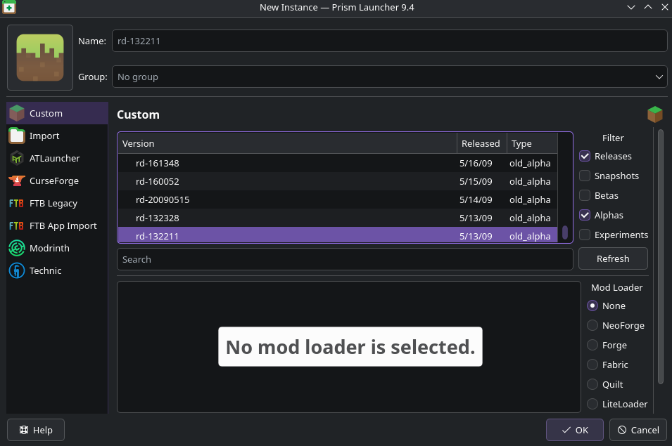
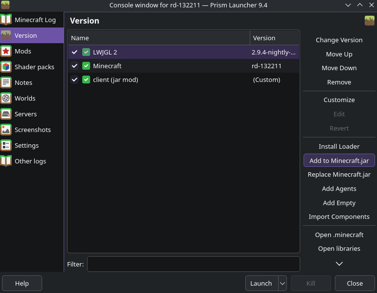
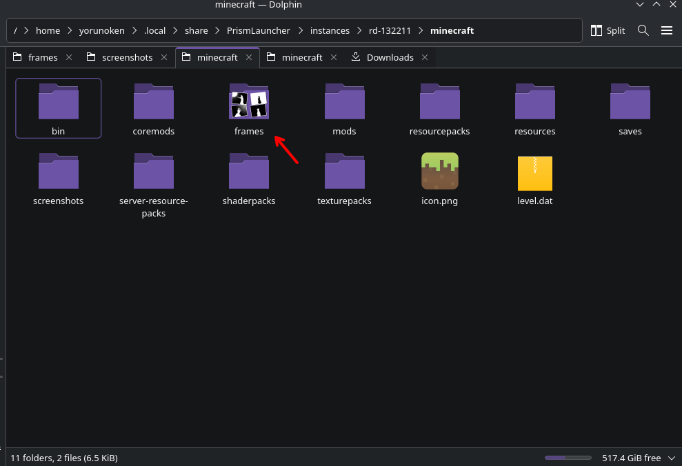

# rotten-apple

this is a simple mod for Minecraft version rd-132211 that adds a video animation of [bad apple](https://www.youtube.com/watch?v=FtutLA63Cp8).

the source code is visible, and you can compile it yourself with IntelliJ.

## installation

since rd-132211 doesn't have a mod loader, you must inject the .jar file manually. the easiest way to do this is using a custom minecraft launcher like [prism launcher](https://prismlauncher.org/).

**step 1:** create an instance of rd-132211 in prism launcher after you finish setting up.

**step 2:** download `rotten-apple.jar` and `frames.zip` from [releases](https://github.com/yorunoken/rotten-apple/releases/latest).

**step 3:** edit your instance (right click -> edit), go to `version`, click `add to minecraft.jar`, and select the `rotten-apple.jar` you downloaded.

**step 4:** open your instance folder and go to the `minecraft` folder. unzip `frames.zip` here. ensure the path looks like: `minecraft/frames/image_001.png`.

## usage

boot the game and wait for the frames to load. find the black tile (this is the top-left pixel of the animation) to position yourself.

press **b** to start.

[license](LICENSE)
